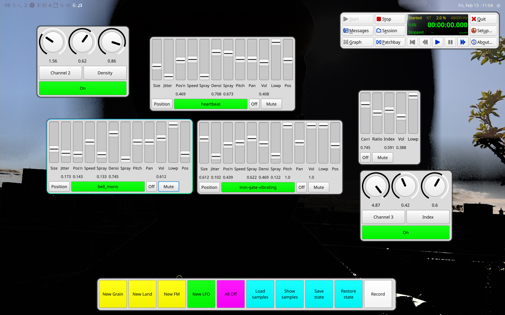

# computergrain

A grain synthesizer with two modes and multiple layers. Can be controlled via MIDI or GUI.
One mode (Land) overlays multiple channels with slightly different generation rates,
that creates modulations between layers for interesting soundscapes, and one mode
that is a classic grain synthesizer, one is a simple frequency modulation.
Multiple samples can be chosen, that all have to be loaded on startup.

To use it, download all the files in this repository to your computer and open 
Main.scd in the [SuperCollider IDE](https://supercollider.github.io/).

More instruction on how to run are in the file.
